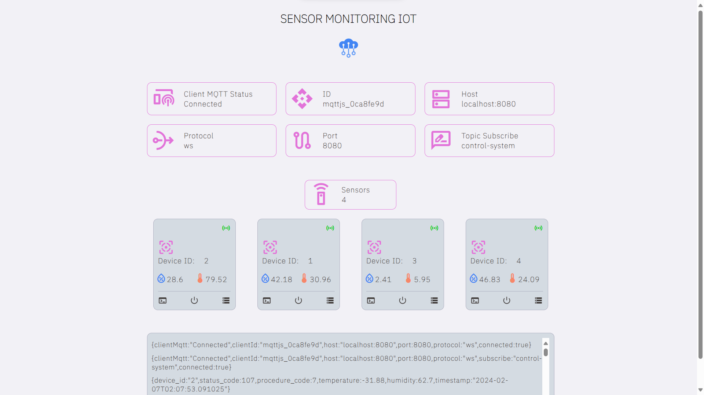

# Monitoreo en tiempo real de sensores, IoT

Desarrollo de una plataforma web para el monitoreo en tiempo real de publicaciones  
utilizando el protocolo MQTT, las cuales representan el estado actual y los parámetros  
de diversos dispositivos de detección.



## Recomendación importante
≧◠‿◠≦

La transmisión de información, sin importar el medio empleado, debe asegurar  
la privacidad y seguridad. Esto conlleva la implementación de medidas como el  
cifrado de datos y la autenticación de clientes o usuarios.

Es importante destacar que este proyecto ha sido creado únicamente con  
fines de prueba y experimentación. Por lo tanto, se recomienda no utilizarlo en  
un entorno de producción sin realizar las adecuaciones de seguridad necesarias.


## Configuración de desarrollo
≧◠‿◠≦

### Requisitos previos

* Conocimientos básicos de terminal y línea de comandos
* Tener instalado [Node.js](https://nodejs.org/en) en tu sistema que incluye [NPM](https://www.npmjs.com/)
* Tener instalado [Mosquitto](https://https://mosquitto.org//) en tu sistema
* Configurar un Broker para administrar los procesos MQTT
   * Crea un archivo de configuración mosquitto.conf en un directorio de tu  
   elección con estos parametros.

      ```ini
      listener 1883
      protocol  mqtt

      listener 8080
      protocol websockets

      allow_anonymous true
      ```

   * Desde la terminal navega al directorio de instalación de mosquitto y luego  
   ejecuta el comando del broker usando la ruta del archivo mosquitto.conf

      ```bash
      ./mosquitto.exe -c <ruta_al_archivo_de_configuracion> -v
      ```
* Este proyecto se integra con este otro proyecto complementario.
[device-sensor-emulator](https://github.com/miniscandal/device-sensor-emulator)

### Proceso de implementación

#### Clonar repositorio

```
git clone https://github.com/miniscandal/sensor-monitoring-iot.git
cd .\sensor-monitoring-iot\
```


#### Instalar módulos requeridos

```
npm install
```

#### Iniciar servidor

```
npm run dev
```


## Documentación 
 ≧◠‿◠≦


### Tecnologías utilizadas


  


### Referencias

* [Preact](https://preactjs.com/)
* [Vite](https://vitejs.dev/)
* [Mosquitto](https://https://mosquitto.org//) 
* [MQTT.js](https://github.com/mqttjs/MQTT.js/)


## Reflexiones y aprendizajes

≧◠‿◠≦

Este proyecto nace de la necesidad de comprender más profundamente la implementación  
del Internet de las Cosas (IoT). Se basa en la experiencia de un primer proyecto  
colaborativo llevado a cabo durante mis estudios universitarios, como aporte para mi  
especialización en IoT.

En el proceso de desarrollo de esta aplicación web, mejoré mis habilidades y utilicé  
el diseño atómico para generar componentes reutilizables, lo que resultó en un  
proyecto más mantenible y escalable. Realicé mejoras significativas en la  
estructura, lógica y funcionalidades, lo que simplificó la navegación y comprensión  
del código.


## Creditos
≧◠‿◠≦


#### Recursos de código abierto

* [Mosquitto](https://https://mosquitto.org//):
  Broker de mensajes que implementa el protocolo MQTT.
* [MQTT.js](https://github.com/mqttjs/MQTT.js/)
  Biblioteca de cliente para el protocolo MQTT.

Agradecimiento a los autores de estas bibliotecas por su trabajo y contribución  
para la comunidad de software libre.


## Licencia

≧◠‿◠≦

Este proyecto está bajo la licencia MIT. Consulta el archivo LICENSE para más detalles.
